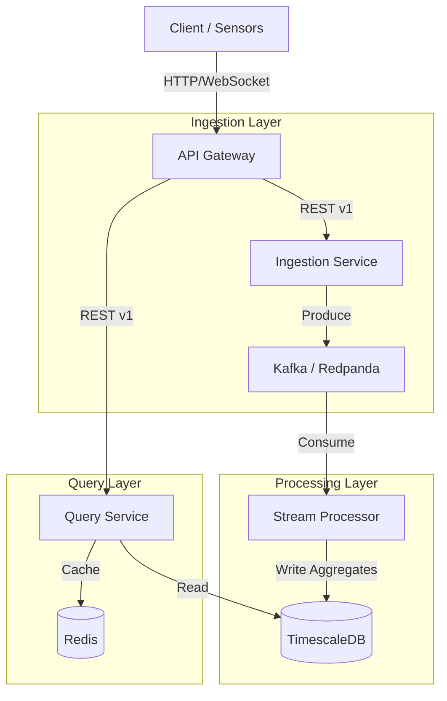

# Real-Time Analytics & Monitoring Platform

A high-performance, multi-tenant analytics platform capable of ingesting, processing, and serving real-time metrics. This project demonstrates distributed system patterns, event-driven architecture, and time-series data management.

## Architecture

## Tech Stack

- **Language:** Python 3.12+ (managed by `uv`)
- **API Framework:** FastAPI (Async)
- **Database:** PostgreSQL + TimescaleDB extension
- **Broker:** Apache Kafka (or Redpanda for dev) + Schema Registry
- **Caching:** Redis
- **Orchestration:** Docker Compose
- **Observability:** Prometheus, Grafana, OpenTelemetry

## Roadmap & Progress

### Phase 1: Foundation (Weeks 1-3)
- [x] Project structure setup with `uv` workspaces
- [x] Docker Compose environment (Postgres/Timescale, Redis)
- [x] Ingestion Service skeleton (FastAPI)
- [x] Database connection (SQLAlchemy Async)
- [x] Basic health checks & structured logging

### Phase 2: Kafka Integration (Weeks 4-6)
- [x] Add Kafka to Docker Compose
- [x] Implement Kafka Producer in Ingestion Service
- [x] Implement Schema Registry (Avro)
- [x] Create Consumer Service (Worker)
- [x] End-to-end data flow (API -> Kafka -> DB)

### Phase 3: Time-Series & Caching (Weeks 7-9)
- [ ] Enable TimescaleDB hypertables
- [ ] Implement continuous aggregations
- [ ] Add Redis caching for Query Service
- [ ] Optimize query performance

### Phase 4: Stream Processing (Weeks 10-13)
- [ ] Real-time windowing/aggregations
- [ ] Alerting rules engine
- [ ] Backpressure handling

### Phase 5: Multi-tenancy & Scaling (Weeks 14-16)
- [ ] Tenant isolation
- [ ] API Rate limiting & Circuit breakers
- [ ] Versioning (v1/v2)

### Phase 6: Observability (Weeks 17-19)
- [ ] Prometheus metrics export
- [ ] Grafana Dashboards
- [ ] OpenTelemetry Tracing
- [ ] Load testing (Locust)
